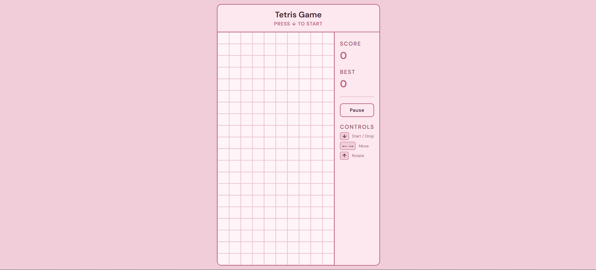
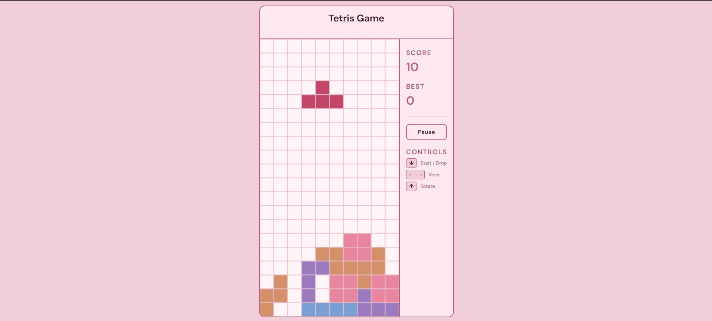
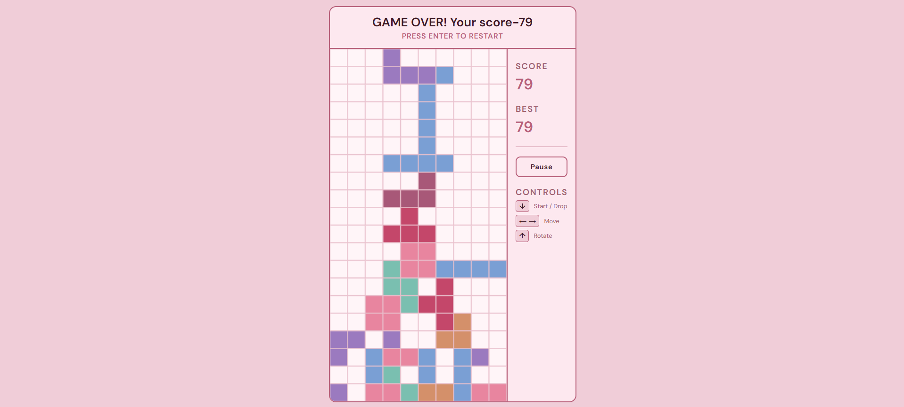

# 🎮 Tetris Game

A browser-based Tetris game built from scratch using vanilla JavaScript, HTML, and CSS — no libraries, no frameworks.


---

## 📸 Screenshots

| Start Screen | Gameplay | Game Over |
|---|---|---|
|  |  |  |

---

## ✨ Features

- Classic Tetris gameplay with all 7 piece types
- Score tracking — earn points for every piece placed and line cleared
- High score saved locally — persists across browser sessions using localStorage
- Increasing speed — game gets faster as your score grows
- Pause / Resume with button or `P` key
- Clean responsive UI with a custom pink theme

---

## 🛠️ Tech Stack

- HTML
- CSS
- JavaScript (vanilla)

---

## 🎯 What I Built

- Full game loop with collision detection using a 2D grid matrix
- Piece rotation logic using coordinate transformation across 4 rotation states
- Line clearing algorithm that shifts all rows above downward
- Dynamic speed system — interval decreases as score increases
- Persistent high score using the browser's localStorage API
- Custom UI with side panel, pause button, and game state messaging

---

## ⌨️ Controls

| Key | Action |
|---|---|
| `↓` or `Enter` | Start / Drop piece |
| `←` `→` | Move piece left / right |
| `↑` | Rotate piece |
| `P` | Pause / Resume |

---

## ⚙️ How to Run

1. Clone the repository
```
git clone https://github.com/Akshitaa-01/Tetris-Game.git
```
2. Open `index.html` in your browser

Or play it live here → **[Live Demo](https://akshitaa-01.github.io/Tetris-Game)**

---

## 📚 What I Learned

- Managing complex game state in vanilla JS without any framework
- How to implement smooth real-time rendering using the Canvas API
- Collision detection using a grid-based approach
- Using `setInterval` dynamically to control game speed
- Browser storage APIs (`localStorage`) for persistent data