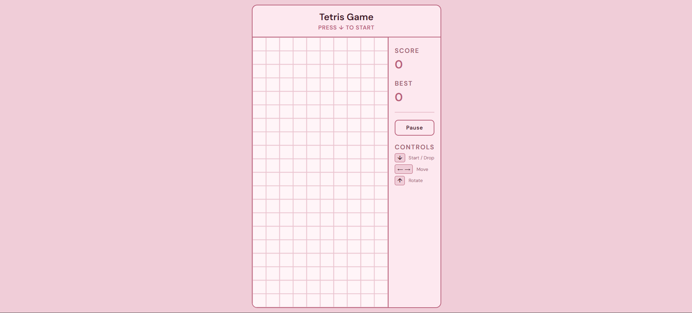
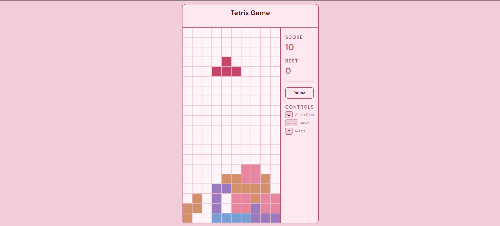
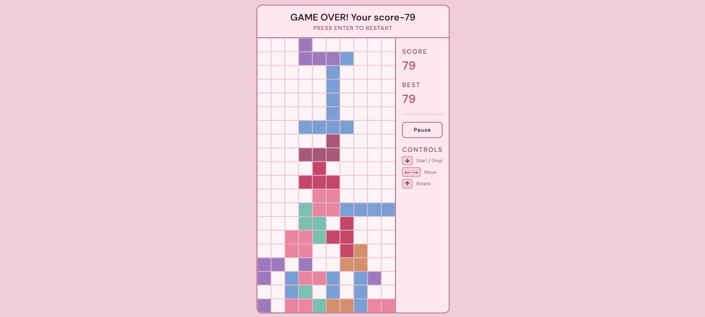

# 🎮 Tetris Game

A browser-based Tetris game built with vanilla JavaScript, HTML, and CSS — no libraries or frameworks.


---

## 📸 Screenshots

| Start Screen | Gameplay | Game Over |
|---|---|---|
|  |  |  |

---

## ✨ Features

- Classic Tetris gameplay with all 7 piece types
- Score tracking for placed pieces and cleared lines
- High score persistence using localStorage
- Increasing difficulty as the level increases
- Start, pause, resume, and restart game states
- Responsive controls for both desktop keyboard and mobile touch input

---

## 🛠️ Tech Stack

- HTML
- CSS
- JavaScript 

---

## 🎯 What I Built

- Game loop and real-time rendering using the Canvas API
- Collision detection using a 2D board matrix
- Piece movement and rotation across 4 rotation states
- Line clearing by detecting completed rows and shifting the board
- Dynamic game speed by decreasing the game interval as the level increases
- Game state management for start, pause, resume, and game over states
- Persistent high score using the browser's localStorage API
- Touch gesture handling using touch events for mobile movement, rotation, and hard drop
- Touch coordinate mapping to identify interactions with the active piece

---

## ⌨️ Controls

### Desktop

| Key | Action |
|---|---|
| `←` `→` | Move piece left / right |
| `↓` | Drop piece |
| `↑` | Rotate piece |

### Mobile

| Gesture | Action |
|---|---|
| `↔` Drag | Move piece left / right |
| `↻` Tap | Rotate piece |
| `↓` Swipe | Drop piece |

---

## ⚙️ How to Run

1. Clone the repository
```
git clone https://github.com/Akshitaa-01/Tetris-Game.git
```
2. Open `index.html` in your browser

Or play it live here → **[Live Demo](https://akshitaa-01.github.io/Tetris-Game)**

---

## 📚 What I Learned

- Managing game state and coordinating different states in JavaScript
- Working with the Canvas API for real-time rendering
- Using 2D arrays to represent and manipulate a game board
- Implementing collision detection and piece rotation logic
- Using `setInterval` to control and dynamically adjust game speed
- Using `localStorage` to persist data across browser sessions
- Handling touch events and converting screen coordinates to canvas coordinates
- Designing responsive interactions for both desktop and mobile